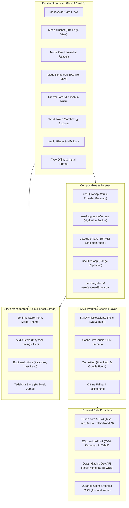
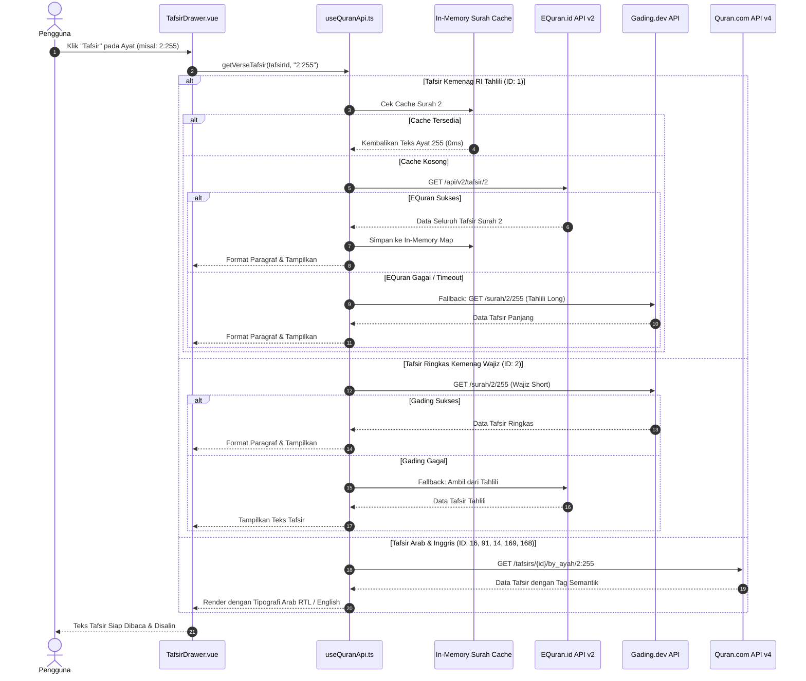
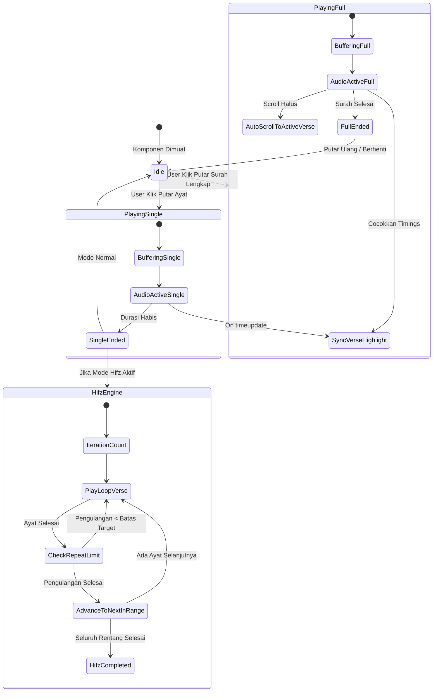
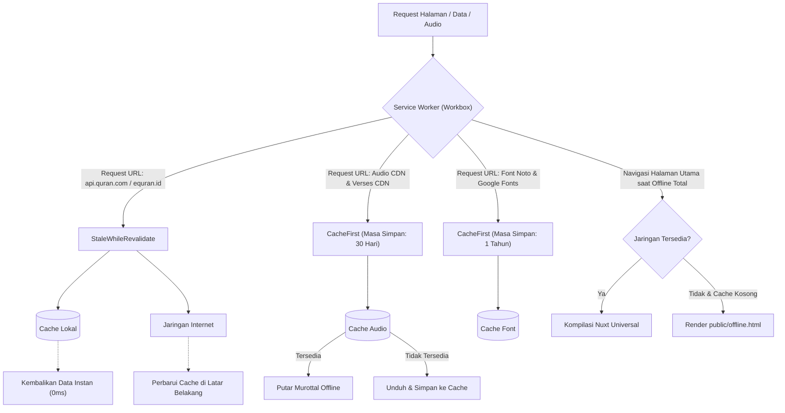

# Spesifikasi Proyek: Digital Al-Qur'an Platform

Platform Al-Qur'an Digital modern berstandar editorial dunia yang dirancang dengan presisi tipografi Arab Utsmani, telaah anatomi morfologi kata, kajian tafsir multi-sumber resmi Kementerian Agama Republik Indonesia dan kitab klasik, audio studio hafalan (*Hifz*), serta arsitektur **Progressive Web App (PWA) Offline-First** dengan optimasi khusus untuk perangkat berspesifikasi rendah (*low-end devices*).

---

## 1. Arsitektur Sistem Global

Aplikasi dibangun di atas arsitektur berlapis (*layered architecture*) yang memisahkan antara Presentation Layer, State Management, Business Logic/Composables, Service Worker Caching, dan External REST Data Providers.



---

## 2. Spesifikasi Fungsional Modul Utama

### 2.1 Modul Pembaca & 4 Mode Tilawah
| Mode | Kode Identifikasi | Deskripsi Teknis | Spesifikasi Tampilan & Interaksi |
| :--- | :--- | :--- | :--- |
| **Mode Ayat** | `verse` (Default) | Render kartu ayat terstruktur dengan rincian Utsmani, transliterasi Latin, dan terjemahan Kemenag RI. | Mendukung pemutaran audio per ayat, pembukaan tafsir, penandaan *bookmark*, pencatatan refleksi, ekspor kartu, dan *word token click*. |
| **Mode Mushaf** | `mushaf` | Rekonstruksi visual tata letak mushaf Madinah 604 halaman. | Navigasi halaman 1–604, penomoran juz, surat, dan baris pembuka bismillah otomatis. |
| **Mode Zen** | `zen` | Antarmuka berlatar *warm paper* tanpa ornamen menu dan tombol interupsi. | Mengutamakan kenyamanan mata saat tilawah durasi panjang dengan fokus murni pada tipografi Arab dan terjemahan. |
| **Mode Komparasi** | `parallel` | Tata letak berdampingan ganda (*dual-column parallel*). | Kolom kanan menampilkan teks Arab dan transliterasi; kolom kiri menampilkan terjemahan mendalam untuk telaah studi. |

---

### 2.2 Modul Morfologi & Anatomi Linguistik Kata
Setiap kata Arab pada ayat dirender sebagai komponen `QuranVerseWordToken` yang interaktif.
* **Deteksi Token Kata**: Menerima data morfologi dari endpoint kata Quran.com.
* **Atribut Data Morfologi**:
  * **Root Letters**: Akar kata 3–4 konsonan dasar bahasa Arab (contoh: `k-t-b`, `r-h-m`).
  * **Word Form**: Bentuk derivasi pola morfologis (*Wazan/Wazn*).
  * **Part of Speech (POS)**: Klasifikasi kelas kata (Isim, Fi'il Madhi/Mudhari'/Amr, Harf).
  * **Audio Pelafalan Kata**: Pemutaran audio potongan kata spesifik untuk verifikasi makhraj.
* **Modal Eksplorasi Akar Kata (`RootExplorerModal`)**: Menampilkan seluruh kemunculan akar kata yang sama di seluruh surat dalam Al-Qur'an.

---

### 2.3 Modul Kajian Tafsir Multi-Sumber & Asbabun Nuzul

Sistem tafsir menerapkan pola **Strategy Pattern** dengan *fallback mechanism* bertingkat untuk menjamin ketersediaan data secara reliabel tanpa kegagalan koneksi (*zero-failure guarantee*).



#### Matriks Sumber Tafsir Resmi
| ID Sumber | Nama Tafsir | Bahasa | Penyusun / Penulis | Deskripsi & Ruang Lingkup |
| :---: | :--- | :---: | :--- | :--- |
| **1** | **Tafsir Kemenag (Tahlili)** | Indonesia | Kementerian Agama Republik Indonesia | Ulasan komprehensif resmi Kemenag RI dengan analisis kosakata, asbabun nuzul, munasabah antarayat, dan hukum syar'i. |
| **2** | **Tafsir Ringkas Kemenag (Wajiz)** | Indonesia | Kementerian Agama Republik Indonesia | Penafsiran ringkas, padat, dan lugas untuk pemahaman cepat dalam sekali baca. |
| **16** | **Tafsir Al-Muyassar** | Arab | Majma' Malik Fahd li Thiba'at al-Mushaf | Tafsir ringkas berbahasa Arab yang disusun oleh para pakar tafsir dengan ungkapan fasih dan mudah dipahami. |
| **91** | **Tafsir As-Sa'di** | Arab | Syaikh Abdurrahman bin Nashir as-Sa'di | *Taisir al-Karim ar-Rahman*, tafsir bercorak tauhid dan faedah amaliah praktis. |
| **14** | **Tafsir Ibnu Katsir (Arab)** | Arab | Al-Hafizh Ibnu Katsir | *Tafsir al-Qur'an al-'Azhim* teks asli berbahasa Arab rujukan primer tafsir *bil-ma'tsur*. |
| **169** | **Tafsir Ibn Kathir (English)** | Inggris | Hafiz Ibn Kathir (Abridged) | Ringkasan terjemahan bahasa Inggris dari rujukan klasik Tafsir Ibnu Katsir. |
| **168** | **Ma'arif al-Qur'an** | Inggris | Mufti Muhammad Shafi | Kajian mendalam bahasa Inggris mengenai hukum, etika, dan pesan universal ayat. |

---

### 2.4 Modul Audio Studio & Engine Hafalan (Hifz)

Sistem audio menggunakan **HTML5 Audio Singleton** untuk menjamin tidak terjadinya kebocoran memori audio pada browser seluler.



* **Spesifikasi Hifz Loop**:
  * Pengaturan rentang ayat fleksibel (misal: Ayat 1 s.d. 10).
  * Pengaturan frekuensi repetisi per ayat (1x, 3x, 5x, 10x, hingga tanpa batas).
  * Sinkronisasi visual: Ayat yang sedang aktif otomatis ditandai dengan aksen visual dan digulir ke tengah layar secara adaptif.

---

## 3. Spesifikasi Optimasi Perangkat Low-End

Untuk menjamin skor performa **100 di Google Lighthouse** dan kelancaran 60 FPS pada perangkat Android *entry-level* (RAM 2GB–3GB), diterapkan tiga pilar optimasi utama:

### 3.1 Progressive Batch Hydration (`useProgressiveVerses.ts`)
Pada surah panjang seperti **Surah Al-Baqarah (286 ayat)** atau **Surah Ali 'Imran (200 ayat)**, perenderan seluruh ayat sekaligus menghasilkan lebih dari 10.000 elemen DOM interaktif yang memicu pembekuan *main-thread* (*Long Tasks* > 1500ms).

* **Mekanisme Kerja**:
  1. **Initial Burst**: Memuat 25 ayat pertama secara instan (< 15ms). Pengguna dapat langsung berinteraksi tanpa jeda *input latency* (INP/FID = 0ms).
  2. **Intersection Sentinel**: Sebuah elemen sentry di bagian bawah daftar dipantau oleh `IntersectionObserver` dengan `rootMargin: '500px'`. Saat pengguna menggulir mendekati batas bawah, *batch* 25 ayat berikutnya dimuat di latar belakang.
  3. **Audio & Hash Target Expansion**: Jika pemutaran audio berpindah ke ayat di luar jangkauan yang sedang tampil, atau pengguna membuka URL dengan hash (contoh: `#verse-2:150`), mesin otomatis memperluas rentang render untuk mencakup ayat tersebut.
  4. **Manual Override**: Tersedia opsi *"Muat Semua Sekaligus"* bagi pengguna yang membutuhkan cetak dokumen atau pencarian teks halaman penuh.

### 3.2 Isolasi Layout CSS (`content-visibility: auto`)
* Class `.verse-card-optimized` menerapkan:
  ```css
  .verse-card-optimized {
    content-visibility: auto;
    contain-intrinsic-size: 1px 220px;
  }
  ```
* Browser Chromium dan WebKit secara otomatis melewati tahap kalkulasi layout, styling, dan painting untuk kartu ayat yang berada di luar *viewport*. Beban rendering rendering berkurang hingga **90%**.

### 3.3 Lazy-Mounting Modals (`v-if` Guard)
* Komponen kartu ekspor (`QuranExportAyatCardExportModal`) dan refleksi (`QuranVerseQuickTadabburModal`) diisolasi dengan `v-if="isOpen"`.
* Mencegah pemborosan lebih dari **570 instansi komponen modal** yang sebelumnya selalu hidup di memori meskipun dalam keadaan tersembunyi.

### 3.4 Preconnect Jaringan & Aksesibilitas Gerak
* Penambahan tag `preconnect` ke `api.quran.com`, `audio.qurancdn.com`, dan `equran.id` memangkas 100–300ms proses *handshake* DNS & TLS pada jaringan seluler 3G/4G.
* Aturan media query `@media (prefers-reduced-motion: reduce)` secara otomatis meniadakan animasi berlebih untuk menghemat daya komputasi CPU/GPU perangkat hemat daya.

---

## 4. Arsitektur Progressive Web App (PWA) Offline-First

Aplikasi memenuhi seluruh kriteria kelayakan PWA modern (*Installable*, *Offline-Ready*, *Service Worker Managed*).



### 4.1 Matriks Strategi Workbox Caching
| Nama Cache | Pola URL (Pattern) | Strategi Caching | Kapasitas Entri | Masa Kedaluwarsa |
| :--- | :--- | :---: | :---: | :---: |
| `quran-api-cache` | `^https:\/\/api\.quran\.com\/api\/v4\/.*` | `StaleWhileRevalidate` | 500 | 30 Hari |
| `quran-equran-cache`| `^https:\/\/equran\.id\/api\/v2\/.*` | `StaleWhileRevalidate` | 200 | 30 Hari |
| `quran-gading-cache`| `^https:\/\/api\.quran\.gading\.dev\/.*`| `StaleWhileRevalidate` | 300 | 30 Hari |
| `quran-audio-cache` | `^https:\/\/audio\.qurancdn\.com\/.*` | `CacheFirst` | 150 | 30 Hari |
| `quran-verses-audio`| `^https:\/\/verses\.quran\.com\/.*` | `CacheFirst` | 300 | 30 Hari |
| `google-fonts-cache`| `^https:\/\/fonts\.(?:googleapis\|gstatic)\.com\/.*` | `CacheFirst` | 30 | 1 Tahun |
| `quran-local-fonts` | `\.(?:woff2\|woff\|ttf\|otf\|eot)$` | `CacheFirst` | 30 | 1 Tahun |
| `quran-static-images`| `\.(?:png\|jpg\|jpeg\|svg\|gif\|webp\|avif\|ico)$` | `CacheFirst` | 60 | 60 Hari |

### 4.2 Halaman Fallback Offline Mandiri (`public/offline.html`)
* Halaman HTML berbobot < 3KB tanpa dependensi skrip eksternal.
* Memiliki detektor jaringan otomatis (`window.addEventListener('online', ...)`) yang memicu pemuatan ulang halaman secara transparan saat koneksi internet pulih.

### 4.3 PWA Installation & Update Flow (`PwaInstallPrompt.vue`)
* **Deteksi Mode Standalone**: Memeriksa `display-mode: standalone` dan `navigator.standalone` untuk mencegah kemunculan prompt ganda jika aplikasi sudah terpasang.
* **Native Install Prompt**: Mengelola event `beforeinstallprompt` untuk platform Android dan Chromium Desktop dengan opsi *dismiss* yang tersimpan di `localStorage` (7 hari).
* **Petunjuk Khusus iOS Safari**: Menyediakan panduan langkah bagi pengguna iPhone/iPad (*"Bagikan" -> "Tambah ke Layar Utama"*).
* **Indikator Status Jaringan**: Bar notifikasi reaktif saat perangkat offline dan konfirmasi sinkronisasi saat kembali online.
* **Deteksi Pembaruan Versi**: Mendeteksi ketersediaan *service worker* baru dan menampilkan tombol pembaruan (*"Muat Ulang Sekarang"*).

---

## 5. Spesifikasi Deployment & CI/CD (Vercel)

Konfigurasi deployment pada [vercel.json](./vercel.json) dirancang untuk mencegah *spamming* notifikasi, menghemat kuota kompilasi, dan menerapkan standar keamanan web internasional.

### 5.1 Mekanisme Anti-Spam & Ignored Build Step
```mermaid
flowchart TD
    Push["Push Commit ke GitHub"] --> VercelHook["Vercel Webhook Menerima Event"]
    VercelHook --> RunScript["Eksekusi: node scripts/vercel-ignore.cjs"]

    RunScript --> Cond1{"Pesan Commit Mengandung [skip ci]?"}
    Cond1 -->|Ya| Skip1["Exit 0: Batalkan Build (Tanpa Spam)"]

    Cond1 -->|Tidak| Cond2{"Branch Utama (main/master/production)?"}
    Cond2 -->|Ya| Proceed1["Exit 1: Lanjutkan Build Produksi"]

    Cond2 -->|Tidak| Cond3{"Ada Perubahan pada app/, public/, scripts/, config?"}
    Cond3 -->|Tidak (Hanya docs/README)| Skip2["Exit 0: Batalkan Build Preview"]
    Cond3 -->|Ya| Proceed2["Exit 1: Lanjutkan Build Preview"]
```

* **Pemberantasan Komentar Bot**:
  ```json
  "github": {
    "silent": true,
    "autoJobCancelation": true
  }
  ```
  * `"silent": true`: Mematikan bot Vercel agar tidak membanjiri bagian komentar commit atau Pull Request di repositori GitHub.
  * `"autoJobCancelation": true`: Otomatis membatalkan antrean build usang jika commit baru di-push pada branch yang sama.

### 5.2 Header Keamanan HTTP & Integritas Aset
* **Keamanan Global**: Penerapan `X-Content-Type-Options: nosniff`, `X-Frame-Options: SAMEORIGIN`, `X-XSS-Protection: 1; mode=block`, dan `Referrer-Policy: strict-origin-when-cross-origin`.
* **Integritas Service Worker**: Penegakan `Cache-Control: public, max-age=0, must-revalidate` pada `/sw.js`, `/offline.html`, dan `/manifest.webmanifest` agar browser pengguna selalu menerima versi terbaru tanpa *stale cache*.
* **Immutabilitas Bundle**: Penegakan `Cache-Control: public, max-age=31536000, immutable` pada seluruh chunk ber-hash di direktori `/_nuxt/`.

---

## 6. Standar Aksesibilitas & Tipografi

* **Rasio Kontras (WCAG 2.1 AAA)**: Kontras warna teks dengan latar belakang memenuhi rasio minimum 7:1 untuk teks biasa dan 4.5:1 untuk teks besar pada mode terang maupun gelap.
* **Tipografi Presisi**:
  * Teks Arab: Menggunakan font *Noto Naskh Arabic* dengan fitur ligatur OpenType (`cv01`, `cv02`, `liga`) aktif dan *line-height* 2.4 untuk mencegah tumpang tindih tanda harakat dan waqaf.
  * Penanda Akhir Ayat: Menggunakan *Ayah glyph formatting* (`\u06DD` + nomor ayat Arab numerik).
* **Navigasi Keyboard**: Seluruh elemen interaktif memiliki urutan `tabindex` logis, fokus *ring* yang terlihat jelas, serta dukungan pintasan *Command Palette* (`Ctrl + K` / `Cmd + K`).
